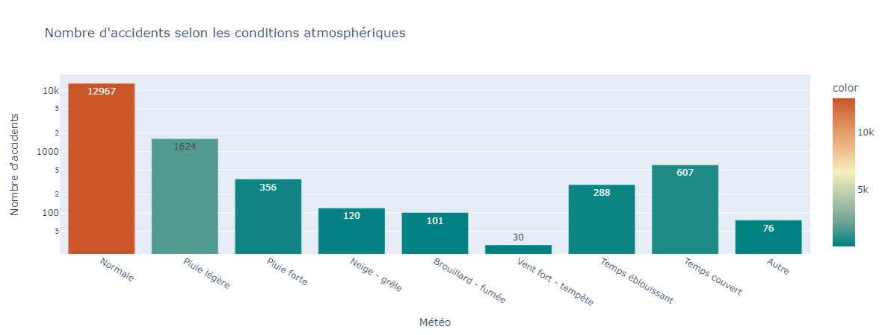
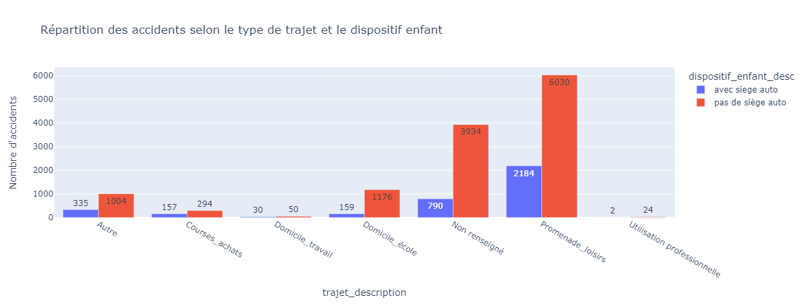
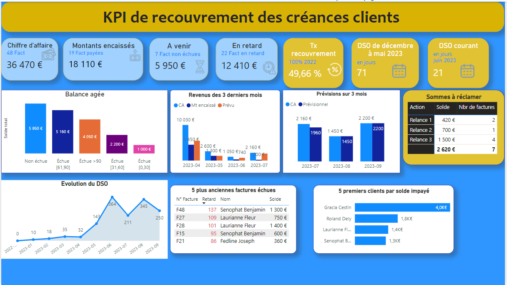
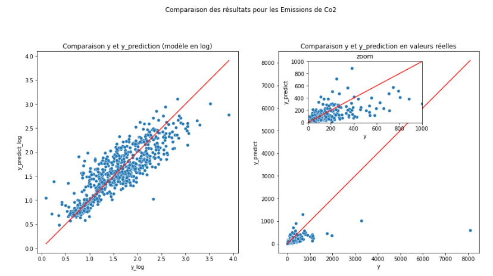
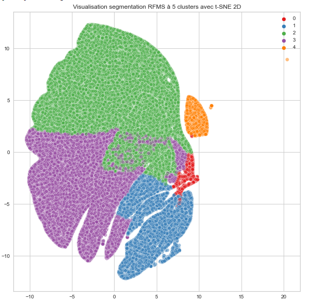

 

# Dolores Valide
### Data Scientist & Analytics Engineer | dbt, Python & Power BI Specialist

I help companies structure their data architectures and automate their data pipelines (dbt, Python, BigQuery) to deploy state-of-the-art decision-making dashboards.

I perform **accurate data audits**, design **interactive dashboards**, and automate workflows to deliver **clear, actionable insights** that drive strategic decisions and improve overall performance.  
Every mission is an opportunity for me to learn, understand my clients' business challenges, and **build tailored, concrete, and high-impact solutions**.

[Contact me for your data projects](mailto:dolores.data.consulting@gmail.com)

---

## Stop wasting time!

Every month, hours are wasted **copying numbers into Excel** or **manually preparing reports**.  
👉 This time could be saved through a **comprehensive data audit** and the deployment of **automated pipelines and dashboards**.

[Request a data audit (2–4 days)](mailto:dolores.data.consulting@gmail.com?subject=Data%20Audit%202-4%20days)

## Table of Contents
- [What I can bring to your team](#what-i-can-bring-to-your-team)
- [General Skills](#general-skills)
- [Technical Skills](#technical-skills)
- [Publications](#publications)
- [Projects](#projects)
    - [D-LAB S.L. — Predictive Modeling & Energy Efficiency](#d-lab-sl--predictive-modeling--energy-efficiency)
    - [Real-Time Financial Data Pipeline & Automation (Python)](#real-time-financial-data-pipeline--automation-python)
    - [Data Audit & Operations Tracking Dashboard — Manufacturing](#data-audit--operations-tracking-dashboard--manufacturing)
    - [International Sales Analysis Dashboard](#international-sales-analysis-dashboard)
    - [French Road Accidents Exploratory Analysis & Prediction (Under-10s)](#french-road-accidents-exploratory-analysis--prediction-under-10s)
    - [Mobile Plans Sales Analysis Dashboard](#mobile-plans-sales-analysis-dashboard)
    - [Debt Collection Automation & Reporting Dashboard](#debt-collection-automation--reporting-dashboard)
    - [Supervised Machine Learning](#supervised-machine-learning)
    - [Unsupervised Machine Learning](#unsupervised-machine-learning)

[Version Française](./index.md)

---

## What I can bring to your team

### ✅ Data Auditing & Bottleneck Identification
- A company's logistics department was spending an average of 3 hours per week manually consolidating shipments and inventory data coming from three different systems. In 3 days, I conducted a full audit of their data sources: identifying duplicates, inconsistencies, and gaps, and delivered a precise blueprint for centralizing and automating their reporting. This plan was used to build a centralized dashboard and workflow, reducing weekly report generation time by 50%.
- For an e-commerce website, customer data was scattered across multiple files and databases, resulting in duplicates and formatting inconsistencies. I executed a comprehensive audit to pinpoint root causes and designed a data-cleaning and restructuring pipeline. Once implemented, data was fully centralized and analysis-ready, enabling precise customer segmentation and boosting marketing campaign ROI.
    
### ✅ Clear KPI Visualization & BI Reporting
- For a telecom client, I built a Power BI dashboard consolidating sales performance by region, product, and time period. Result: the executive board could track key performance indicators at a glance and make faster, data-driven decisions.
    
### ✅ Analytics Engineering & Workflow Automation
- A debt collection firm was losing valuable time generating weekly reports. I automated their extraction and consolidation pipelines, shrinking a multi-hour manual task down to a few minutes.

### ✅ Actionable Business Insights & Recommendations
### ✅ Tailored Methodologies & Business-First Approach

---

## General Skills

- Data Analysis & Predictive Modeling
- Analytics Engineering & Dimensional Modeling (dbt)
- Data Visualization & Insights Translation
- Critical Thinking & Analytical Problem Solving
- Agile Methodologies & Collaborative Teamwork

## Technical Skills

 

    <!-- Data Engineering & Analytics Engineering -->
    

      
    

    

      
    

    

      
    

    

      
    

    

      
    

    <!-- Data Analysis & BI -->
    

      
    

    

      
    

    

      
    

    

      
    

    <!-- Databases -->
    

      
    

    

      
    

    

      
    

    

      
    

 

---

## Publications

**Medium:** [Data Science vs. Algorithmic Trading: A Duel of Technological Titans](https://medium.com/@valide.dolores/data-science-vs-trading-algorithmique-un-duel-de-titans-technologiques-0d6acab938b6) 

**Medium:** [5 Essential Data Structures for Data Scientists and Data Engineers](https://medium.com/@valide.dolores/5-structures-de-donn%C3%A9es-essentielles-pour-les-data-scientists-et-data-engineers-fae5509f4b84)

---

## Projects

### D-LAB S.L. — Predictive Modeling & Energy Efficiency
- **Context:** Co-founded a data engineering and consulting firm based in the Canary Islands (under the ZEC special tax framework). Our core mission is developing custom Data Science solutions and predictive algorithms designed to drive energy efficiency and utilities optimization for commercial buildings and the tourism sector.
- **Skills:** R&D, Predictive Modeling, Python, Tech Project Management, Cloud Architecture.
- **Results:** 
  > - Designed machine learning models to forecast and minimize energy, water, and resources consumption.
  > - Successfully prepared and submitted the corporate ZEC application for tax-efficient operations in the Canary Islands.

### Real-Time Financial Data Pipeline & Automation (Python)
- **Context:** Built and deployed an automated Python architecture to ingest and process high-frequency financial data streams. Echoing my research published on Medium, the goal was to manage asynchronous processes to run decision-making scripts continuously with minimal latency.
- **Skills:** Python, Asynchronous programming (asyncio/WebSockets), REST API Integration, Exception Handling & Logging.
- **Key Contributions:**
  > - Developed robust Python scripts designed to listen to live market feeds via WebSockets.
  > - Structured and normalized incoming raw JSON payloads on-the-fly to fuel a local decision algorithm.
  > - Secured outbound transactional pipelines (signed REST API calls) with strict error-handling patterns to prevent downtime.
- **Results:**
  > - Achieved a 100% automated ingestion-to-execution pipeline operating without manual oversight.
  > - Built a production-grade 24/7 framework backed by structured logs and automated reconnect alerts.

### Data Audit & Operations Tracking Dashboard — Manufacturing
- **Context:** Identified query performance and data structural bottlenecks in a legacy operational database. The project aimed to streamline reporting between shop-floor production teams and upper management, saving time during weekly coordination syncs, and uncovering structural flaws in the initial data model.
- **Skills:** Power BI Service, SQL, Power Query, DAX
- **Key Contributions:**
   > - Executed a comprehensive database audit and delivered a detailed data quality assessment report.
   > - Built a highly interactive Power BI dashboard tracking work orders and building-level equipment maintenance.
- **Results:**
   > - Visualized bottlenecks instantly, eliminating manual data lookup.
   > - Exposed operational software limitations and formulated actionable, scalable architecture recommendations.
   > - Provided exhaustive developer and user documentation.

 | 

### International Sales Analysis Dashboard
- **Context:** Leveraged global dataset from Rainforest Global to explore and visualize international sales performance across multiple countries and suppliers. The dashboard highlights top-performing geographical markets, identifies key strategic suppliers, and tracks sales trend timelines. This analytical report helps compare cross-market performance, streamline supplier partnerships, and optimize global expansion strategies.
- **Skills:** Power BI, Data Modeling, Advanced Visualization, Data Storytelling.

### French Road Accidents Exploratory Analysis & Prediction (Under-10s)
- **Description:** An exploratory and predictive project aimed at raising awareness about road safety hazards involving children under 10. The project includes extensive Exploratory Data Analysis (EDA) followed by supervised machine learning models to predict accident severity based on environmental and situational features.
- **Skills:** EDA, Python, Supervised Regression
- **Project Link:** [GitHub Repository](https://github.com/DValide/Projet_perso_Accidents_routiers_de_mineurs_de_moins_de_10_ans)
- 
- 

### Mobile Plans Sales Analysis Dashboard
- **Description:** Explored historical sales datasets from SmartFun Telecom Ltd. This project uncovers critical sales trends and hidden geographic patterns through statistical analysis and exploratory visualization.
- **Skills:** Power BI, EDA

### Debt Collection Automation & Reporting Dashboard
- **Context:** Streamlined the tracking, analytics, and daily reporting of outstanding client debts.
- **Skills:** Power BI Service, Power Query
- **Key Contributions:**
   > - Cleansed, transformed, and modeled complex debt collection records.
   > - Created a robust executive Power BI dashboard with critical KPI alerts.
   > - Designed and automated the daily report dispatch.
- **Results:**
   > - Reduced reporting overhead by 66% while dramatically increasing visibility of urgent collections.

  
### Supervised Machine Learning
- **Description:** Developed a predictive regression framework to forecast commercial building energy consumption. Models were evaluated using metrics such as RMSE, R², and MAE across several algorithms, including SVR, Random Forest, Elastic Net, and LightGBM.
- **Skills:** EDA, Scikit-learn, Feature Engineering, Hyperparameter Tuning, Cross-Validation
- 
- **Project Link:** [GitHub Repository](https://github.com/DValide/OC-DS-P4-Anticipez-les-besoins-en-consommation-de-batiments/tree/f1629b960ff2629a1dfc09eb2946cf1e948696bb)

### Unsupervised Machine Learning
- **Description:** Applied clustering algorithms to segment e-commerce customer bases into behavioral personas using K-means, DBSCAN, and Principal Component Analysis (PCA).
- **Skills:** Scikit-learn, Clustering, PCA, RFM Modeling

- **Project Link:** [GitHub Repository](https://github.com/DValide/OC-DS-P5-Segmentez-des-clients-d-un-site-e-commerce/tree/main)

---

### Contact

  
  
  

